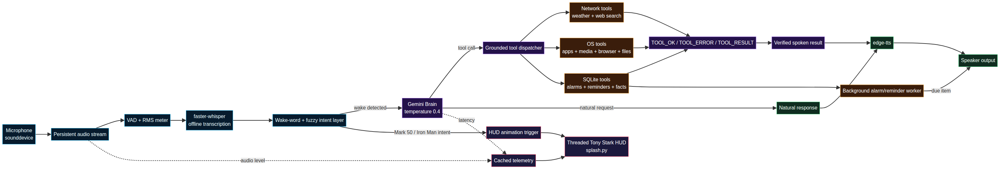
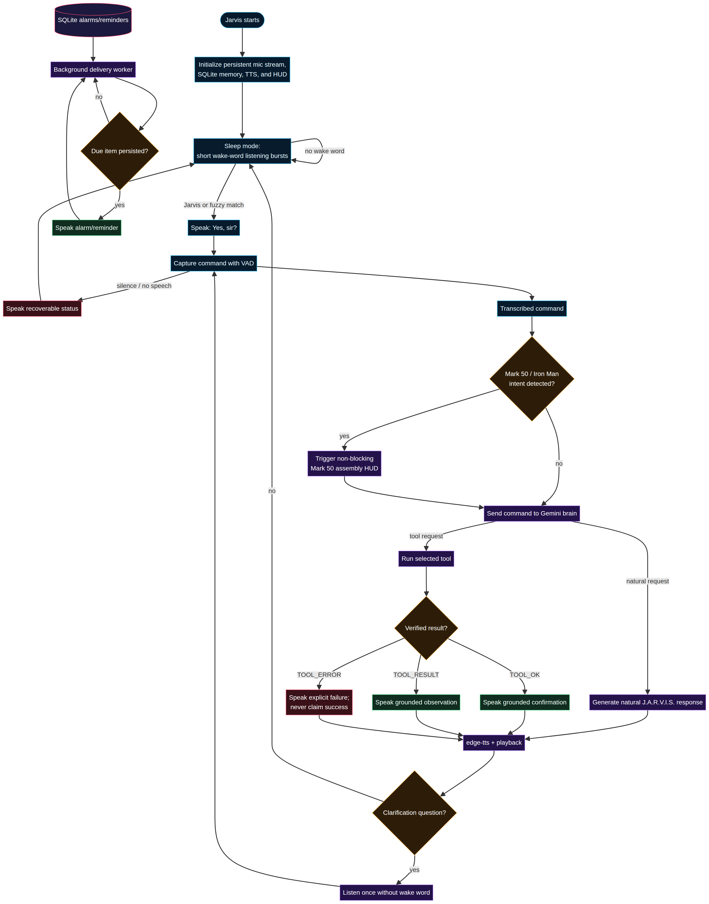

<div align="center">

<h1 align="center">J.A.R.V.I.S.</h1>

<h3 align="center">Just A Rather Very Intelligent System</h3>

<p align="center">A local-first Python voice assistant with a Tony Stark-inspired HUD, low-latency speech pipeline, fuzzy Mark 50 suit activation, persistent alarms, and grounded tool execution.</p>

<p align="center">
  <a href="https://www.python.org/"></a>
  <a href="https://ai.google.dev/"></a>
  <a href="https://github.com/SYSTRAN/faster-whisper"></a>
  <a href="https://www.sqlite.org/"></a>
  <a href="https://www.apple.com/macos/"></a>
  <a href="https://mermaid.js.org/"></a>
  <a href="#tool-grounding-and-reliability"></a>
</p>

<br />

<p align="center"><strong>Voice in. Verified action or natural response out.</strong></p>

</div>

> Jarvis is an independent, Tony Stark-inspired personal project. It is not affiliated with Marvel, Disney, or any other rights holder.

## Overview

Jarvis is a continuously running desktop voice assistant designed around a simple principle: **tool-backed claims must be based on verified tool results**. It listens through a persistent microphone stream, detects the wake word with fuzzy matching, transcribes commands locally with faster-whisper, sends reasoning and tool selection to Gemini, and speaks the result with edge-tts.

The interface is a browser-served HUD rather than a separate frontend application. It displays live listening state, CPU and memory telemetry, SQLite status, network activity, model response latency, microphone intensity, and the Mark 50 assembly sequence without blocking the voice-critical path. Gemini remains configured at `temperature=0.4`, preserving natural conversational responses outside the tool boundary.

## What makes this build different

| Capability | What it does |
| --- | --- |
| **Tony Stark HUD** | Displays live status, diagnostics, telemetry, audio intensity, and response latency in a cinematic interface. |
| **Mark 50 assembly mode** | Detects fuzzy Iron Man / Mark 50 suit intent and triggers a non-blocking red-and-gold armor assembly animation with a triangular blue arc reactor and foot repulsors. |
| **Low-latency voice loop** | Keeps one microphone stream open, uses short VAD chunks, caches telemetry, and queues HUD/audio updates away from capture. |
| **Grounded tool execution** | Every tool result is normalized to `TOOL_OK`, `TOOL_ERROR`, or `TOOL_RESULT`; the assistant never claims a failed action succeeded. |
| **Persistent alarms and reminders** | Stores scheduled items in SQLite and delivers due events from a background worker. |
| **Local-first boundaries** | Speech recognition and persistence run locally; Gemini is used for conversational reasoning and tool selection. |

## Visual system architecture



The editable source is available at [`docs/architecture.mmd`](docs/architecture.mmd). The runtime is split into four cooperating paths: the voice path, the Gemini/tool path, the persistence worker, and the non-blocking HUD telemetry path.

## End-to-end voice workflow



The editable workflow source is available at [`docs/workflow.mmd`](docs/workflow.mmd). A normal conversation stays natural, while tool calls return directly from verified results so a second model turn cannot embellish a failure or invent a completion.

## Core runtime flow

```text
Microphone
   │
   ▼
Persistent sounddevice stream ──► VAD + RMS audio meter
   │
   ▼
faster-whisper transcription
   │
   ▼
Wake-word and fuzzy intent layer
   ├── Mark 50 / Iron Man intent ──► Non-blocking HUD animation
   └── User command ──────────────► Gemini brain
                                      ├── Natural response ──► edge-tts ──► Speaker
                                      └── Tool call ─────────► Verified result ─► Speaker
```

## Features

### Cinematic HUD and live telemetry

The HUD is served by a threaded Python HTTP server from `jarvis/splash.py`. It exposes live state and telemetry endpoints used by the browser interface, including CPU, memory, SQLite, network, model latency, and microphone intensity. State writes are coalesced and persisted asynchronously so animation and diagnostics do not block speech capture.

### Fuzzy Mark 50 suit activation

`jarvis/main.py` uses fuzzy matching rather than a single deterministic phrase. Natural variations around Mark 50, Iron Man, armor, suit, reactor, and assembly can activate the visual sequence. The animation includes red and gold plates, a compact triangular blue arc reactor, foot repulsors, and a flight-ready finish while keeping the HUD’s blue thinking theme intact.

### Low-latency speech pipeline

The microphone stream remains open for the lifetime of the process. Voice activity detection reads short chunks, stops after configured silence, and publishes the audio intensity meter through a queue. HUD state updates and telemetry are asynchronous or cached, and the voice loop avoids unnecessary blocking sleeps.

### Persistent alarms and reminders

Alarms and reminders are written to SQLite before Jarvis acknowledges them. Each scheduling tool returns a confirmed database row ID, rejects invalid times, and uses a background worker to retrieve and mark due items. If persistence fails, Jarvis speaks an explicit failure instead of a success-like response.

## Tool catalog

| Tool | Purpose | Grounding behavior |
| --- | --- | --- |
| `get_weather(location)` | Current weather through OpenWeatherMap geocoding and weather endpoints. | Validates input, HTTP status, response schema, and API failures. |
| `web_search(query)` | Top DuckDuckGo HTML search result. | Handles empty queries, request failures, non-success responses, and incomplete result markup. |
| `open_application(app_name)` | Launch a desktop application. | Confirms that the OS launch request was spawned; reports subprocess errors. |
| `play_media(service, query)` | Start Apple Music or Spotify playback on macOS. | Checks service, query, AppleScript exit status, and supported platform. |
| `media_control(action)` | Play, pause, next, or previous. | Reports unsupported platforms, inactive players, and AppleScript failures. |
| `power_control(action, confirm)` | Request macOS shutdown or restart. | Requires the exact confirmation token `confirm` and reports OS rejection. |
| `get_system_info(category)` | CPU thermal status, RAM, battery, and disk diagnostics. | Validates category and propagates unsupported-platform or component errors. |
| `set_alarm(text, time)` | Persist an alarm in SQLite and speak it when due. | Returns a verified row ID or `TOOL_ERROR`. |
| `set_reminder(text, time)` | Persist a reminder in SQLite and deliver it when due. | Returns a verified row ID or `TOOL_ERROR`. |
| `get_time()` | Read local wall-clock time. | Returns a timestamp with an explicit success contract. |
| `open_website(url)` | Open an HTTP or HTTPS URL in the default browser. | Validates the URL and checks launcher failure. |
| `play_youtube(query)` | Find and open a YouTube result. | Reports direct-result opening or verified search-page fallback. |
| `find_file(name)` | Search Documents, Desktop, and Downloads. | Never searches system folders; reports matches or no-match errors. |
| `describe_file(name)` | Read text, code, DOCX, PDF, or image content. | Rejects ambiguity and reports unreadable or unsupported files. |
| `open_file(name)` | Open a matching file with its default application. | Checks the OS open request and reports failure. |
| `remember_fact(key, value)` | Persist durable facts such as names and preferences. | Validates both fields and confirms SQLite persistence. |

## Tool grounding and reliability

Every tool result follows one of three contracts:

```text
TOOL_OK:     The operation succeeded and can be confirmed.
TOOL_ERROR:  The operation failed, was rejected, or could not be verified.
TOOL_RESULT: The tool returned grounded information without a side effect.
```

The brain’s dispatcher catches exceptions, rejects empty results, preserves explicit contracts, and wraps legacy informational outputs safely. After a tool call, the spoken response is generated directly from the verified result. This prevents the conversational model from converting a failed subprocess, unavailable network service, ambiguous file, or unsupported platform into a fabricated success.

## Quick start

### 1. Clone and create a virtual environment

```bash
git clone https://github.com/Samarssj/Jarvis-prototype.git
cd Jarvis-prototype
python3 -m venv .venv
source .venv/bin/activate
```

On Windows PowerShell, activate with `.venv\\Scripts\\Activate.ps1`. The primary runtime and media integrations are designed for macOS.

### 2. Install dependencies

```bash
python -m pip install --upgrade pip
pip install -r requirements.txt
pip install python-docx pypdf
```

The optional `python-docx` and `pypdf` packages enable DOCX and PDF inspection through `describe_file`.

### 3. Configure environment variables

```bash
cp .env.example .env
```

At minimum, set `GEMINI_API_KEY`. Set `OPENWEATHER_API_KEY` if you want weather lookups. The remaining variables tune speech, VAD, the HUD, model timeout, and SQLite storage. Jarvis also accepts `GOOGLE_API_KEY` as a compatibility alias, but `GEMINI_API_KEY` is the recommended name.

### 4. Run Jarvis

```bash
python -m jarvis.main
```

For a single text-driven request without the continuous microphone loop:

```bash
python -m jarvis.run_once "what time is it"
python -m jarvis.run_once "find my resume" --speak
```

### If Jarvis says the Gemini API key is missing

Make sure the `.env` file is inside the same project directory that contains the `jarvis/` folder. The file should contain a real key without placeholder brackets:

```dotenv
GEMINI_API_KEY=your_actual_gemini_key
```

Then restart Jarvis from that project directory. The loader now searches the project-root `.env`, preserves keys exported in the shell, and also recognizes `GOOGLE_API_KEY`. If no key is found, Jarvis speaks one actionable configuration message, does not open the microphone, does not claim to have processed the command, and exits cleanly instead of repeating the command and returning to sleep.

## Configuration reference

| Variable | Default | Description |
| --- | --- | --- |
| `GEMINI_API_KEY` | — | Required Gemini API key for reasoning and tool selection. |
| `OPENWEATHER_API_KEY` | — | Optional key for `get_weather`. |
| `JARVIS_WAKE_WORD` | `jarvis` | Wake word and fuzzy matching anchor. |
| `JARVIS_MODEL` | `gemini-flash-latest` | Gemini model name. |
| `JARVIS_MODEL_TIMEOUT_MS` | `20000` | Maximum model request timeout. |
| `JARVIS_STT_MODEL` | `tiny.en` | faster-whisper model; `base.en` trades latency for accuracy. |
| `JARVIS_SAMPLE_RATE` | `16000` | Microphone sample rate in Hz. |
| `JARVIS_VAD_SILENCE_LIMIT` | `1.0` | Seconds of silence before command capture ends. |
| `JARVIS_VAD_NO_SPEECH_TIMEOUT` | `2.0` | Initial wait for speech after Jarvis begins listening. |
| `JARVIS_RECORD_SECONDS` | `8` | Maximum command recording duration. |
| `JARVIS_TTS_VOICE` | `en-GB-RyanNeural` | Edge TTS voice. |
| `JARVIS_TTS_RATE` | `+0%` | Speech rate. |
| `JARVIS_TTS_PITCH` | `-2Hz` | Speech pitch adjustment. |
| `JARVIS_SPLASH_DURATION_MS` | `3500` | HUD startup animation duration. |
| `JARVIS_DB_PATH` | `jarvis_history.sqlite3` | SQLite database path. |

## Memory and scheduling

Jarvis maintains two SQLite-backed memory layers. Rolling conversation history supports short-term context, while durable facts persist user preferences and personal details across sessions. Alarms and reminders use the same database and are delivered by a background worker that marks each item after successful announcement.

Accepted scheduling formats include ISO-8601 timestamps and natural phrases such as:

```text
in 30 minutes
in 2 hours
tomorrow at 7
9 pm
```

Invalid or ambiguous times are rejected instead of being silently normalized into an unintended schedule.

## Safety boundaries

File search is limited to `Documents`, `Desktop`, and `Downloads`; it does not crawl the full home directory or system paths. Power control requires an exact confirmation token and administrator authorization from macOS. Media, browser, and system-diagnostics integrations return explicit unsupported-platform errors when the host cannot perform them.

## Project structure

```text
jarvis/
├── main.py             Continuous voice loop, wake word, fuzzy Mark 50 intent
├── run_once.py         One-shot text entry point with the same tool registry
├── brain.py            Gemini orchestration and grounded tool dispatcher
├── memory.py           SQLite history, facts, alarms, and reminders
├── splash.py           Threaded HUD server, telemetry, and animations
├── stt.py              Persistent microphone stream, VAD, and transcription
├── tts.py              Edge TTS synthesis and playback
└── tools/
    ├── alarm.py
    ├── reminder.py
    ├── weather.py
    ├── web_search.py
    ├── app_control.py
    ├── browser.py
    ├── file_manager.py
    ├── system_info.py
    └── time_tool.py

docs/
├── architecture.mmd    Editable architecture source
├── architecture.png     README-ready architecture render
├── workflow.mmd         Editable workflow source
└── workflow.png         README-ready workflow render
```

## Verification

The current implementation has been checked with the project’s runtime audits and an offline failure-injection harness covering every registered tool. The checks cover HUD write latency, audio queueing, telemetry caching, fuzzy suit intent, alarm/reminder persistence, invalid-time rejection, tool exception handling, unsupported-platform handling, and grounded spoken responses.

```text
FUZZY_INTENT=PASS
HUD_AUDIT=PASS
ALARM_REMINDER_PERSISTENCE=PASS
ALL_TOOLS_GROUNDING=PASS
```

## References

1. [Shields.io badge service](https://shields.io/) — visual technology badges used in this README.
2. [GitHub: Creating Mermaid diagrams](https://docs.github.com/en/get-started/writing-on-github/working-with-advanced-formatting/creating-diagrams) — Mermaid diagrams in GitHub Markdown.
3. [Google Gemini API documentation](https://ai.google.dev/) — model and SDK reference.
4. [faster-whisper](https://github.com/SYSTRAN/faster-whisper) — local speech-to-text engine.

## Roadmap

Jarvis remains an evolving side project. Planned directions include richer multi-turn context, more local-first tools, expanded platform adapters, and deeper HUD diagnostics while preserving the current grounding and latency guarantees.
